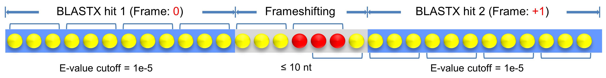
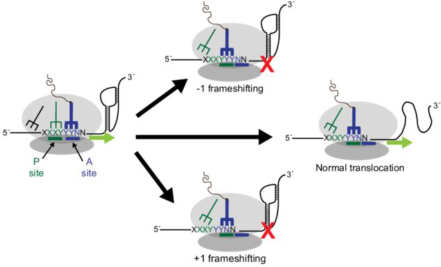

# FScanR: an R package to detect Programmed Ribosomal Frameshifting (PRF) events from mRNA/cDNA

‘FScanR’ identifies Programmed Ribosomal Frameshifting (PRF) events from BLASTX output 
in tab format containing the best hits of targeted mRNA/cDNA sequences against 
the peptide library of the same species or a close relative.

To acquire the input file with 14 columns in tab-delimited format, which is generated by BLASTX, parameters should be used for BLASTX: 

	-outfmt '6 qseqid sseqid pident length mismatch gapopen qstart qend sstart send evalue bitscore qframe sframe'

For details, please visit <https://doi.org/10.1111/1755-0998.13023>.

## :gear: Install FScanR in R (>= 3.5.0)

	library(devtools)
	install_github("seanchen607/FScanR")
	library(FScanR)

## :orange_book: What is Programmed Ribosomal Frameshifting (PRF)?

- From [*Mauger et al., 2013, FEBS Letters*](https://doi.org/10.1016/j.febslet.2013.03.002)

Ribosomal frameshifting, also known as translational frameshifting or translational recoding, is a biological phenomenon 
that occurs during translation that results in the production of multiple, unique proteins from a single mRNA. 
The process can be programmed by the nucleotide sequence of the mRNA and is sometimes affected by the secondary, 3-dimensional mRNA structure.
It has been described mainly in viruses (especially retroviruses), retrotransposons and bacterial insertion elements, and also in some cellular genes.

For details, please visit [Ribosomal frameshift](https://en.wikipedia.org/wiki/Ribosomal_frameshift).

## :pencil2: Authors

Xiao CHEN, PhD

Herbert Irving Comprehensive Cancer Center, Columbia University Medical Center, New York

<https://www.researchgate.net/profile/Xiao_Chen126>

If you use [FScanR](https://github.com/seanchen607/FScanR) in
published research, please cite the most appropriate paper(s) from this
list:

1.  **X Chen**, Y Jiang, F Gao\*, W Zheng, TJ Krock, NA Stover, C Lu, LA Katz & W Song (2019). 
    Genome analyses of the new model protist Euplotes vannus focusing on genome rearrangement and resistance 
    to environmental stressors. ***Molecular Ecology Resources***, 19(5):1292-1308. doi:
    [10.1111/1755-0998.13023](https://doi.org/10.1111/1755-0998.13023).

